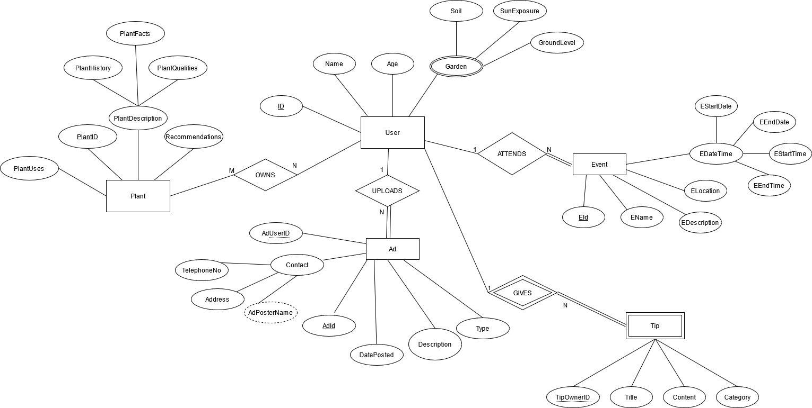
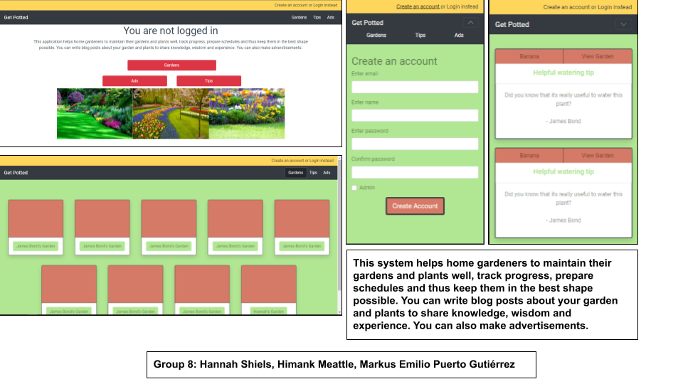

# Backend and Frontend Template

Latest version: https://git.ita.chalmers.se/courses/dit341/group-00-web (public Github [mirror](https://github.com/dit341/group-00-web))

## Project Structure

| File        | Purpose           | What you do?  |
| ------------- | ------------- | ----- |
| `server/` | Backend server code | All your server code |
| [server/README.md](server/README.md) | Everything about the server | **READ ME** carefully! |
| `client/` | Frontend client code | All your client code |
| [client/README.md](client/README.md) | Everything about the client | **READ ME** carefully! |
| [docs/DEPLOYMENT.md](docs/DEPLOYMENT.md) | Free online production deployment | Deploy your app online in production mode |
| [docs/LOCAL_DEPLOYMENT.md](docs/LOCAL_DEPLOYMENT.md) | Local production deployment | Deploy your app local in production mode |

## Requirements

The version numbers in brackets indicate the tested versions but feel free to use more recent versions.
You can also use alternative tools if you know how to configure them (e.g., Firefox instead of Chrome).

* [Git](https://git-scm.com/) (v2) => [installation instructions](https://www.atlassian.com/git/tutorials/install-git)
  * [Add your Git username and set your email](https://docs.gitlab.com/ce/gitlab-basics/start-using-git.html#add-your-git-username-and-set-your-email)
    * `git config --global user.name "YOUR_USERNAME"` => check `git config --global user.name`
    * `git config --global user.email "email@example.com"` => check `git config --global user.email`
  * > **Windows users**: We recommend to use the [Git Bash](https://www.atlassian.com/git/tutorials/git-bash) shell from your Git installation or the Bash shell from the [Windows Subsystem for Linux](https://docs.microsoft.com/en-us/windows/wsl/install-win10) to run all shell commands for this project.
* [Chalmers GitLab](https://git.ita.chalmers.se/) => Login with your **Chalmers CID** choosing "Sign in with" **Chalmers Login**. (contact [support@chalmers.se](mailto:support@chalmers.se) if you don't have one)
  * DIT341 course group: https://git.ita.chalmers.se/courses/dit341
  * [Setup SSH key with Gitlab](https://docs.gitlab.com/ee/ssh/)
    * Create an SSH key pair `ssh-keygen -t ed25519 -C "email@example.com"` (skip if you already have one)
    * Add your public SSH key to your Gitlab profile under https://git.ita.chalmers.se/profile/keys
    * Make sure the email you use to commit is registered under https://git.ita.chalmers.se/profile/emails
  * Checkout the [Backend-Frontend](https://git.ita.chalmers.se/courses/dit341/group-00-web) template `git clone git@git.ita.chalmers.se:courses/dit341/group-00-web.git`
* [Server Requirements](./server/README.md#Requirements)
* [Client Requirements](./client/README.md#Requirements)

## Getting started

```bash
# Clone repository
git clone git@git.ita.chalmers.se:courses/dit341/group-00-web.git

# Change into the directory
cd group-00-web

# Setup backend
cd server && npm install
npm run dev

# Setup frontend
cd client && npm install
npm run serve
```

> Check out the detailed instructions for [backend](./server/README.md) and [frontend](./client/README.md).

## Visual Studio Code (VSCode)

Open the `server` and `client` in separate VSCode workspaces or open the combined [backend-frontend.code-workspace](./backend-frontend.code-workspace). Otherwise, workspace-specific settings don't work properly.

## System Definition (MS0)

### Purpose

We are making this system to help gardeners in Sweden who want to maintain their plants well, track progress, prepare schedules and thus keep their plants and gardens in the best shape possible. Users can instantly advertise what they are offering or looking for and can also comment on any advertisements in the system. We’ll allow the users to share their own wise wisdom regarding their plants. Descriptions and pictures of all plants in the garden will be kept in the system, which can be added by the users.

### Pages

* Home: This page will show all key features of our system i.e. the garden, the advertisement, the login and the gallery page. The user is able to navigate to the individual feature’s pages. The page will also show whether the user is logged in or not and if logged in, a button for logging out.

*  Account/Login: This page will allow users to create a user account or login to the system. It will also show options like “forget username” and “forget password”. To create an account, the system will ask for a username, password and an email. The rest of the fields  (such as date of birth, contact number etc.) will be optional and can be filled in any time later on.

* Advertisements: This page will have listings of local services or tools offered. The user will be able to post an advertisement offering something or asking for something. Registered users may post their own advertisements here. Registered users can also comment on any advertisements that are posted. Non-registered users can only view advertisements.

* Gardens: All users can view other posted gardens showing details about the size, soil, and number of plants. Only registered users can create or edit their own garden. The user can navigate to each individual garden to view more details.

* Plants: Within a user’s garden, all plants are shown. Each plant is shown with an image, name and description, along with schedules for water/ fertilizer. Users can write a tip for the plant and have an option to view all tips pertaining to that specific plant.

* Tips: Users can search and view all tips in the system on this page.

### Entity-Relationship (ER) Diagram



## Teaser (MS3)


