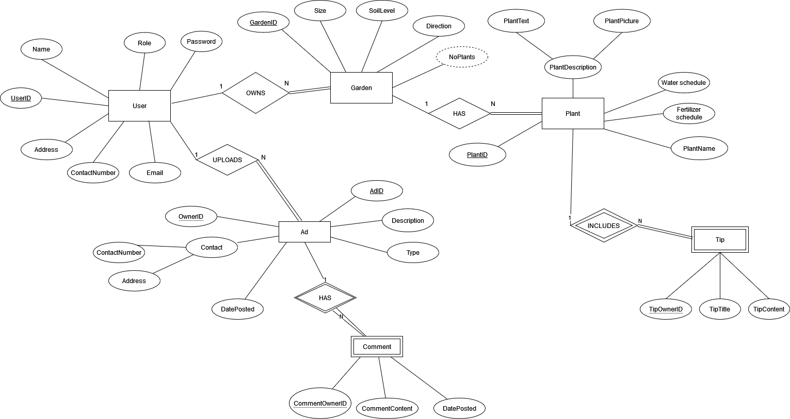

# Backend and Frontend Template

Latest version: https://git.ita.chalmers.se/courses/dit341/group-00-web (public Github [mirror](https://github.com/dit341/group-00-web))

## Project Structure

| File        | Purpose           | What you do?  |
| ------------- | ------------- | ----- |
| `server/` | Backend server code | All your server code |
| [server/README.md](server/README.md) | Everything about the server | **READ ME** carefully! |
| `client/` | Frontend client code | All your client code |
| [client/README.md](client/README.md) | Everything about the client | **READ ME** carefully! |
| [docs/DEPLOYMENT.md](docs/DEPLOYMENT.md) | Free online production deployment | Deploy your app online in production mode |
| [docs/LOCAL_DEPLOYMENT.md](docs/LOCAL_DEPLOYMENT.md) | Local production deployment | Deploy your app local in production mode |

## Requirements

The version numbers in brackets indicate the tested versions but feel free to use more recent versions.
You can also use alternative tools if you know how to configure them (e.g., Firefox instead of Chrome).

* [Git](https://git-scm.com/) (v2) => [installation instructions](https://www.atlassian.com/git/tutorials/install-git)
  * [Add your Git username and set your email](https://docs.gitlab.com/ce/gitlab-basics/start-using-git.html#add-your-git-username-and-set-your-email)
    * `git config --global user.name "YOUR_USERNAME"` => check `git config --global user.name`
    * `git config --global user.email "email@example.com"` => check `git config --global user.email`
  * > **Windows users**: We recommend to use the [Git Bash](https://www.atlassian.com/git/tutorials/git-bash) shell from your Git installation or the Bash shell from the [Windows Subsystem for Linux](https://docs.microsoft.com/en-us/windows/wsl/install-win10) to run all shell commands for this project.
* [Chalmers GitLab](https://git.ita.chalmers.se/) => Login with your **Chalmers CID** choosing "Sign in with" **Chalmers Login**. (contact [support@chalmers.se](mailto:support@chalmers.se) if you don't have one)
  * DIT341 course group: https://git.ita.chalmers.se/courses/dit341
  * [Setup SSH key with Gitlab](https://docs.gitlab.com/ee/ssh/)
    * Create an SSH key pair `ssh-keygen -t ed25519 -C "email@example.com"` (skip if you already have one)
    * Add your public SSH key to your Gitlab profile under https://git.ita.chalmers.se/profile/keys
    * Make sure the email you use to commit is registered under https://git.ita.chalmers.se/profile/emails
  * Checkout the [Backend-Frontend](https://git.ita.chalmers.se/courses/dit341/group-00-web) template `git clone git@git.ita.chalmers.se:courses/dit341/group-00-web.git`
* [Server Requirements](./server/README.md#Requirements)
* [Client Requirements](./client/README.md#Requirements)

## Getting started

```bash
# Clone repository
git clone git@git.ita.chalmers.se:courses/dit341/group-00-web.git

# Change into the directory
cd group-00-web

# Setup backend
cd server && npm install
npm run dev

# Setup frontend
cd client && npm install
npm run serve
```

> Check out the detailed instructions for [backend](./server/README.md) and [frontend](./client/README.md).

## Visual Studio Code (VSCode)

Open the `server` and `client` in separate VSCode workspaces or open the combined [backend-frontend.code-workspace](./backend-frontend.code-workspace). Otherwise, workspace-specific settings don't work properly.

## System Definition (MS0)

### Purpose

We are making this system to help gardeners in Sweden who want to keep the gardens in the best shape possible. Users can instantly find what they are looking for using our epic filters for the stores, advertisements and jobs located near them. We’ll give users the ultimate guide on how to manage their garden, and allow them to share their own wise wisdom as well. Users can also find reliable and top rated gardening services through our system.

### Pages

* Home: This page will show the features of our system, highlighting the products and services stores page, the events page, the advertisement board page, plant wikipedia page, and our gardening tips page. The user is able to navigate to these pages or login/create an account.

*  Account/Login: This page will allow users to log into the application and create their account. To create an account it will only ask for a username, password and your location, however It only requires your username and password to log in. The user then has the option to put more information about themselves in the account page.

* Products and Services Stores: The page will show off the product or service store you search for based on your area, through a map.

* Events: This page will show information about gardening social events in Sweden and a user will be able to search events if gps/location is enabled. To be able to register for an event, the user should be logged in and if the user is not logged in, a button takes the user to the login page.

* Advertisement Board: This page will have listings of local services or tools offered. Registered users may post their own ad here.

* Plant Wikipedia: This page will act as wikipedia for plants. Users will be able to search and go to relevant information pages just like wikipedia. The page will allow the user to take or add a pic of the plant and the system will search for a relevant information page.

* Gardening Tips: This page will have the latest tips from users that have posted their experiences with their gardens, as well as the recommendations that the system gives to all users. The user will have the option to choose from who they read the tips from: the other gardeners or the gardening system.


### Entity-Relationship (ER) Diagram



## Teaser (MS3)


